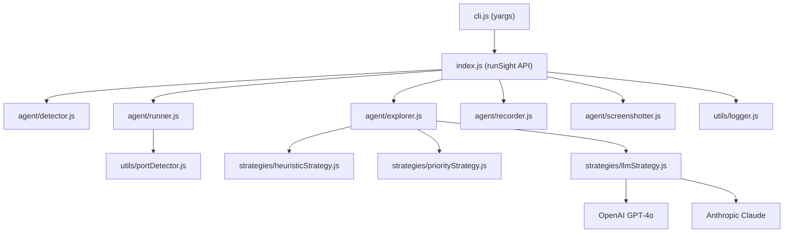

# Architecture

## Vision

RunSight is the **fastest path from code to proof**. It's evolving from a browser automation tool into the default way to generate demos for software.

The architecture is designed to support three phases:
1. **v1.x** — Local agent: detect → run → explore → capture → report
2. **v2.x** — Shareable output: local agent + hosted demo links (`runsight.dev`)
3. **v3.x** — Workflow integration: CI triggers → auto-generated demos on every push

## Overview

RunSight is a modular autonomous agent that detects, runs, and explores web projects.

## Modules

| Module | Path | Responsibility |
|--------|------|----------------|
| CLI | `cli.js` | Parse arguments, invoke API |
| API | `index.js` | Orchestrate full pipeline |
| Detector | `agent/detector.js` | Identify project types (Node.js/Python/static), detect frameworks, return run commands. Supports monorepo scanning. |
| Runner | `agent/runner.js` | Install deps via spawn, start dev servers, detect ports from stdout, manage process lifecycle. Includes killAll() and identifyFrontend(). |
| Explorer | `agent/explorer.js` | 3-tier exploration loop: heuristic discovery → priority scoring → LLM guidance. Dialog handling, error capture, stop conditions, summary generation. |
| Screenshotter | `agent/screenshotter.js` | Full-page PNG capture with step naming. Blank screen detection via text content check. |
| Recorder | `agent/recorder.js` | Playwright recordVideo context wrapper. Auto-converts to mp4 if FFmpeg available. |
| Logger | `utils/logger.js` | Dual output: logs.txt + report.json. Tracks steps, errors, screenshots. |
| Port Detector | `utils/portDetector.js` | Parse ports from stdout via regex, TCP poll with timeout. Zero external deps. |
| Heuristic | `strategies/heuristicStrategy.js` | DOM-order element discovery (links, buttons, inputs, selects). Filters by visibility/size. Executes with dummy data. |
| Priority | `strategies/priorityStrategy.js` | Score elements by semantic importance (nav +30, primary btn +25, input +20, etc). Visit tracker prevents repeats. |
| LLM | `strategies/llmStrategy.js` | Vision LLM-guided action selection. Supports OpenAI GPT-4o and Anthropic Claude. Validates API keys, parses JSON responses, graceful fallback on error. |

## Data Flow

1. **Detect** → Scan project directory for markers (`package.json`, `requirements.txt`, `index.html`)
2. **Run** → Install dependencies, start dev servers, detect ports
3. **Explore** → Launch browser, navigate to frontend URL, execute 3-tier exploration loop
4. **Capture** → Screenshot at each step, record video for full session
5. **Report** → Save `logs.txt` (human) + `report.json` (machine) + screenshots + video

## Exploration Strategy Tiers

### Tier 1: Heuristic (Base)
- Finds all interactable DOM elements (links, buttons, inputs, selects)
- Filters by visibility, size, enabled state
- Executes actions in DOM order with dummy data for inputs

### Tier 2: Priority-based (Scoring)
- Scores elements by semantic importance (nav links > primary buttons > inputs > secondary)
- Tracks visited URLs and clicked elements to avoid repeats
- Above-the-fold elements get bonus score

### Tier 3: LLM-guided (Vision)
- Sends screenshot + element list to GPT-4o or Claude
- LLM decides which element to interact with next and why
- Falls back to priority tier on API failure

## Future Modules (Planned)

These modules don't exist yet but represent the architectural direction:

| Module | Phase | Responsibility |
|--------|-------|----------------|
| Demo Editor | v1.2.0 | Trim dead time from videos, generate highlight reels, add captions |
| Flow Narrator | v1.2.0 | Generate human-readable flow summaries from step data |
| Screenshot Grid | v1.2.0 | Composite single image from all step screenshots |
| HTML Reporter | v1.2.0 | Visual report with embedded screenshots and video player |
| Upload Service | v2.0.0 | Push outputs to `runsight.dev`, return shareable URL |
| Demo Versioning | v2.0.0 | Compare demos across commits, track changes |
| CI Plugin | v3.0.0 | GitHub Actions / GitLab CI integration, auto-trigger on push |
| PR Bot | v3.0.0 | Auto-comment demo links on pull requests |

## Design Decisions

### Why Playwright over Puppeteer?
- Built-in video recording (`recordVideo`) — no FFmpeg dependency for basic video
- Better cross-browser support (Chromium, Firefox, WebKit)
- Auto-waiting and better stability for dynamic pages
- Active development by Microsoft

### Why 3-tier exploration instead of LLM-only?
- **Cost**: LLM calls cost money per screenshot analyzed (~$0.004/image with GPT-4o)
- **Speed**: Heuristic + priority runs in milliseconds; LLM adds 1-3s per step
- **Reliability**: LLM APIs can fail; heuristic/priority always work
- **Offline**: Works without API keys in heuristic+priority mode

### Why CommonJS over ESM?
- Maximum compatibility with existing Node.js tooling
- Simpler `require()` for agent skill integration
- No `.mjs` extension confusion

### Trade-offs

| Decision | Pro | Con |
|----------|-----|-----|
| Playwright recordVideo | No external deps, works headless | Only captures browser viewport, not system |
| Stdout port detection | Zero deps, works with any server | May miss non-standard output formats |
| DOM-based element discovery | Fast, reliable, no vision needed | Misses canvas/WebGL/iframe content |
| Priority scoring | Deterministic, predictable | May miss context-dependent important elements |
| LLM vision | Understands visual context | Slow, costly, requires API key |
